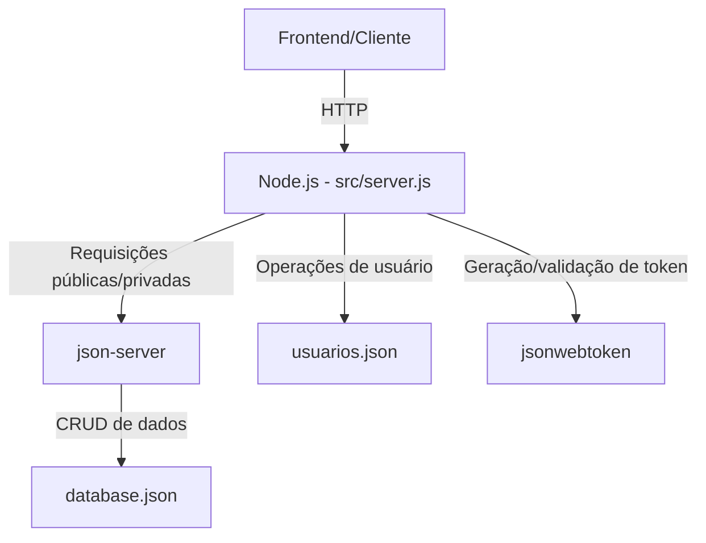

<div align="center">

# API AluraBooks

[](https://github.com/ESousa97/api-alurabooks/actions/workflows/ci.yml)
[](https://www.codefactor.io/repository/github/esousa97/api-alurabooks)
[](https://github.com/ESousa97/api-alurabooks/actions/workflows/codeql.yml)
[](https://opensource.org/licenses/ISC)
[](#)

**Backend mock robusto e realista para simular e-commerce com autenticação JWT moderna, acelerando o desenvolvimento frontend.**

</div>

---

> **⚠️ Projeto Arquivado**
> Este projeto não recebe mais atualizações ou correções. O código permanece disponível como referência e pode ser utilizado livremente sob a licença ISC. Fique à vontade para fazer fork caso deseje continuar o desenvolvimento.

---

## Índice

- [Sobre o Projeto](#sobre-o-projeto)
- [Arquitetura](#arquitetura)
- [Diferenciais](#diferenciais)
- [Funcionalidades](#funcionalidades)
- [Tecnologias](#tecnologias)
- [Começando](#começando)
  - [Pré-requisitos](#pré-requisitos)
  - [Instalação](#instalação)
  - [Uso Local](#uso-local)
- [Exemplos de Uso](#exemplos-de-uso)
- [Referência da API](#referência-da-api)
- [Scripts Disponíveis](#scripts-disponíveis)
- [Estrutura do Projeto](#estrutura-do-projeto)
- [Testes e Qualidade](#testes-e-qualidade)
- [Deployment](#deployment)
- [FAQ](#faq)
- [Contribuição](#contribuição)
- [Licença](#licença)
- [Contato](#contato)

---

## Sobre o Projeto

No desenvolvimento de aplicações web modernas, especialmente usando frameworks como React, um backend confiável é essencial para simular cenários reais de consumo de dados e autenticação. O **API AluraBooks** oferece uma API REST mock de alta fidelidade, com endpoints públicos e protegidos por autenticação JWT.

O sistema combina a simplicidade do [`json-server`](https://github.com/typicode/json-server) para CRUD automático com uma camada Node.js personalizada para autenticação segura baseada em JSON Web Tokens (JWT). Assim, é possível experimentar todos os fluxos reais de registro, login, obtenção de token e acesso a rotas protegidas, de maneira leve e didática.

O repositório prioriza:

- **Fluxos reais de autenticação** — JWT emitido e validado a cada requisição protegida
- **Simples de rodar** — Nenhuma dependência externa além de Node.js
- **Extremamente editável** — Dados facilmente manipuláveis via arquivos JSON
- **Didático** — Ideal para treinar, ensinar ou experimentar integrações frontend sem montar um backend completo
- **Padrão de mercado** — Experiência idêntica ao fluxo de APIs modernas

---

## Arquitetura

A arquitetura é minimalista, moderna e modular, focada em *developer experience*:

- **Node.js Server** — Orquestrador principal e camada de autenticação
- **Autenticação JWT** — Rotas públicas para login/registro, emissão e validação de tokens
- **Middleware de Proteção** — Exige token válido nas rotas privadas
- **JSON Server** — CRUD completo e instantâneo baseado no `database.json`
- **Armazenamento em arquivos** — Usuários (`usuarios.json`) e dados da aplicação (`database.json`)

### Esquema Simplificado



---

## Diferenciais

- ✅ **Fluxos reais de autenticação** — JWT emitido e validado a cada requisição protegida
- ✅ **Zero configuração complexa** — Basta Node.js instalado
- ✅ **Dados editáveis** — Manipule `database.json` e `usuarios.json` diretamente
- ✅ **Didático e profissional** — Ideal para aprendizado e prototipação
- ✅ **Padrão de mercado** — Experiência idêntica a APIs em produção

---

## Funcionalidades

- **Registro de Usuário** — `POST /public/registrar` com validação de email único
- **Login** — `POST /public/login` retorna `access_token` JWT válido
- **Endpoints REST protegidos** — `/livros`, `/pedidos` (token obrigatório)
- **Endpoints públicos** — `/public/lancamentos` sem necessidade de autenticação
- **Proteção real por JWT** — Fluxo completo que simula produção
- **Fácil extensão** — Basta editar `database.json` ou criar novas rotas em `src/server.js`

---

## Tecnologias

### Core


### Ferramentas de Desenvolvimento


| Categoria           | Tecnologia     | Observação                     |
| ------------------- | -------------- | ------------------------------ |
| **Runtime**         | Node.js ≥14.x  | Padrão da indústria            |
| **API Mock**        | json-server    | CRUD REST automático           |
| **Auth**            | jsonwebtoken   | Geração e validação de JWT     |
| **Middleware**      | body-parser    | Parse de requests JSON         |
| **Banco de Dados**  | Arquivos JSON  | Simples, editável, zero config |
| **Package Manager** | npm            | Gerenciamento de dependências  |

**Requisitos mínimos:**

- Node.js 14+ (recomendado)
- npm (geralmente já vem com o Node)

---

## Começando

### Pré-requisitos

```bash
node --version  # v14 ou superior
npm --version
```

### Instalação

1. **Clone o repositório**

```bash
git clone https://github.com/ESousa97/api-alurabooks.git
cd api-alurabooks
```

2. **Instale as dependências**

```bash
npm install
```

3. **Configure variáveis de ambiente**

```bash
cp .env.example .env
```

### Uso Local

**Modo autenticado (recomendado):**

```bash
npm run start-auth
```

API disponível em `http://localhost:8000`

**Modo aberto (sem autenticação):**

```bash
npm run start
```

API pública em `http://localhost:3000`

---

## Exemplos de Uso

### 1. Registro de usuário

```bash
curl -X POST http://localhost:8000/public/registrar \
  -H "Content-Type: application/json" \
  -d '{
    "nome": "Ada Lovelace",
    "email": "ada@example.com",
    "senha": "password123"
  }'
```

### 2. Login

```bash
curl -X POST http://localhost:8000/public/login \
  -H "Content-Type: application/json" \
  -d '{
    "email": "ada@example.com",
    "senha": "password123"
  }'
```

**Resposta:**
```json
{
  "access_token": "eyJhbGciOiJIUzI1NiIsInR5cCI6IkpXVCJ9...",
  "user": {
    "id": 1,
    "nome": "Ada Lovelace",
    "email": "ada@example.com"
  }
}
```

### 3. Acesso a rota protegida

```bash
curl -X GET http://localhost:8000/livros \
  -H "Authorization: Bearer <SEU_TOKEN_AQUI>"
```

### 4. Rota pública

```bash
curl -X GET http://localhost:8000/public/lancamentos
```

---

## Referência da API

### Autenticação (Endpoints Públicos)

#### `POST /public/registrar`
Cria novo usuário no sistema.

**Campos obrigatórios:**
- `nome` (string)
- `email` (string, único)
- `senha` (string)

**Resposta de sucesso:** `201 Created`

#### `POST /public/login`
Autentica usuário e retorna token JWT.

**Campos obrigatórios:**
- `email` (string)
- `senha` (string)

**Resposta de sucesso:** `200 OK`
```json
{
  "access_token": "JWT_TOKEN",
  "user": { "id": 1, "nome": "...", "email": "..." }
}
```

### Dados Protegidos (JWT Necessário)

Todos os endpoints abaixo requerem header `Authorization: Bearer <token>`

- `GET /livros` — Lista todos os livros
- `POST /livros` — Cria novo livro
- `GET /livros/:id` — Busca livro por ID
- `PUT /livros/:id` — Atualiza livro
- `DELETE /livros/:id` — Remove livro
- `GET /pedidos` — Lista todos os pedidos

> **Nota:** CRUD completo via json-server. Consulte [json-server docs](https://github.com/typicode/json-server) para mais operações.

### Dados Públicos

- `GET /public/lancamentos` — Lista lançamentos sem necessidade de autenticação

---

## Scripts Disponíveis

```bash
# Iniciar servidor com autenticação
npm run start-auth

# Iniciar servidor sem autenticação
npm start

# Executar testes
npm test

# Executar lint
npm run lint

# Formatar código automaticamente
npm run format
```

---

## Estrutura do Projeto

```
api-alurabooks/
├── .github/
│   └── workflows/
│       ├── ci.yml              # Pipeline de CI
│       └── codeql.yml          # Análise de segurança
├── docs/                       # Documentação adicional
├── src/
│   └── server.js               # Servidor Node.js + camada de autenticação
├── tests/                      # Testes automatizados
├── .env.example                # Exemplo de variáveis de ambiente
├── .gitignore                  # Arquivos ignorados pelo Git
├── database.json               # Base de dados mock (livros, pedidos, etc.)
├── usuarios.json               # Base de usuários registrados
├── package.json                # Dependências e scripts
├── thumbnail.png               # Thumbnail do projeto
└── README.md                   # Este arquivo
```

---

## Testes e Qualidade

### Executar testes

```bash
npm test
```

### Lint e formatação

```bash
npm run lint
npm run format
```

### CI/CD

O projeto possui CI automatizado com GitHub Actions que executa:
- Lint de código
- Testes automatizados
- Auditoria de segurança (npm audit)
- Análise estática com CodeQL

---

## Deployment

> **⚠️ Atenção:** Este projeto é para **desenvolvimento local e fins educacionais**.

**Não utilize em produção:**
- Arquivos JSON não são adequados para ambientes multiusuário
- Não há suporte para cloud ou dados sensíveis
- Ideal apenas para prototipação e aprendizado

---

## FAQ

### Erro 401 ao acessar rotas protegidas?
Você precisa obter um token válido através do endpoint de login antes de acessar rotas protegidas.

### Posso usar em produção?
Não. Este projeto foi criado para desenvolvimento local e fins educacionais apenas.

### Como adicionar novos dados?
Edite o arquivo `database.json` diretamente e reinicie o servidor.

### Como adicionar novos endpoints?
Edite o arquivo `src/server.js` e adicione suas rotas personalizadas.

---

## Contribuição

Contribuições são bem-vindas! Para contribuir:

1. **Fork o projeto**
2. **Crie uma branch para sua feature:**
   ```bash
   git checkout -b feature/nome-da-feature
   ```
3. **Commits descritivos** seguindo [Conventional Commits](https://www.conventionalcommits.org/)
4. **Abra um Pull Request** para a branch `main`

---

## Licença

Este projeto está sob a licença ISC. Veja o texto completo em [ISC License](https://opensource.org/licenses/ISC).

```
ISC License - você pode usar, copiar, modificar e distribuir este código.
```

---

## Equipe e Créditos

**Autor original:** Vinicios Neves (Alura)  
**Mantenedor:** José Enoque Costa de Sousa

---

## Contato

**José Enoque Costa de Sousa**

[](https://www.linkedin.com/in/enoque-sousa-bb89aa168/)
[](https://github.com/SousaDev97)
[](https://enoquesousa.vercel.app)

Dúvidas ou sugestões? Abra uma [issue no GitHub](https://github.com/ESousa97/api-alurabooks/issues).

---

<div align="center">

**[⬆ Voltar ao topo](#api-alurabooks)**

Feito com ❤️ por [José Enoque](https://github.com/SousaDev97)

**Status do Projeto:** Archived — Sem novas atualizações

</div>
